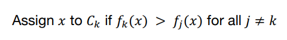

# Classification and Logistic Regression

## Classification

- classification the value y take on only a small number of discrete values
- binary classification the values y can take on only two values, + or -
- given x, y는 training example의  label으로 간주한다.

## Decision Boundary

- c1, c2 class가 있다고 가정했을때,
- classifier는 new data x가 클래스 c1에 있을때만, 그것을 c1으로 할당합니다.
    - 분류함수 h(x) = k if (x ∈ D1)
- Decision boundaries (or surface)는 결정영역 사이의 경계이다.

## Discriminant Function

- fk는 Discriminant Function (or score) ex) fk(x) = P(Ck | x)
- 즉 classifier는h(x) = argmax_k g_k(x)로 정의됩니다.
- f_k()가 discriminant functions set이고, 단조 증가 함수라면
    - g_k() = g(f_k())’ 같은 함수도 discriminant functions입니다.
        - h(g_k(x)) = a* g_k(x) + b (a > 0, b에 대해)
        - h(g_k(x)) = log g_k(x)

## Bayes Decision Rule

- 모든 k ≠ j에 대해 p(C_k|x) > p(C_j|x)이면 x를 클래스 Ck로 분류합니다.
- discriminant function인 f_k(x) = P(x | C_k)P(C_k) 는 정규화 factor가 없어도 bayes rule에 의해서 사용할 수 있습니다.

## Logistic Regression

- linear predictor의 output이 [0, 1] 범위에 제한되도록 hθ(x)를 변경합니다.
    
    
    
    - 여기서 g(z) = 1 / (1 + exp(-z))는 시그모이드(또는 로지스틱) 함수입니다.
- Note
    - g(z) → 1 (z → ∞)
    - g(z) → 0 (z → -∞)
    - g(-z) = 1 - g(z)
    - g'(z) = g(z)(1 - g(z))
    
- Binary classification
    - hθ(x)를 사용하여 주어진 x에 대한 각 클래스의 확률을 모델링합니다.
    - 이것은 베르누이 분포로 설명되는 P(y|x; θ)를 이끌어 냅니다.
        
        
        
    - likelihood (and log-likelihood)는 아래와 같이 요약됩니다.
    
    
    

### Approach 1: Stochastic Gradient Ascent (확률적)

- maximize the likelihood를 위해 gradient ascent를 사용가능
    - update rule은 아래와 같다.
        
        
        
- single example이 주어졌을 때,  θ의 미분은 다음과 같이 계산됩니다.

- 최종 stochastic gradient ascent는 다음과 같습니다.

### Approach 2: Newton-Raphson Method (뉴턴-랩슨)

- 함수 f: ℝ → ℝ가 주어진 경우, 뉴턴의 방법은 f(θ) = 0인 θ값을 찾으려고 합니다.
- 다음 업데이트를 반복적으로 수행합니다.
    
    
    
- 현재 추측 x에서 함수 f를 선형 함수(함수 f의 접선)로 근사화합니다.
- 선형 함수가 0이 되는 곳을 찾습니다.
- 선형 함수가 0이 되는 곳에서 x의 다음 추측을 합니다.
- The maxima of log-likelihood은 첫 번째 l'(θ) = 0인 지점에 해당합니다.
- Newton’s method을 사용하여 l'(θ) = 0인 θ를 찾을 수 있습니다.
    - f(x) = l'(θ)로 두면, 업데이트 규칙은 다음과 같이 얻어집니다.
        
        
        
- Newton-Raphson method
    
    
    
    - 여기서 H는 헤시안 행렬로 정의됩니다.
        
        
        
- 이 방법은 (batch) gradient descent/ascent 에 비해 더 빠른 수렴을 달성합니다 (즉, 최소값에 매우 가까워지기 위해 훨씬 적은 반복을 수행 합니다)

- 다른 해석은 목적 함수 l(θ)의 현재 점 x^(*) 주변에서 이차 근사 (또는 2차 테일러 급수 확장)를 최소화하는 것입니다.*
- *현재 점 J(*θ)에서 θ^t 의 2차 테일러 급수 확장은 다음과 같습니다.
    
    
    
    - ∇²J(θ^(t))*는 θ = θ^(t)*에서 평가된 J(θ)의 헤시안입니다.
- θ에 대해 미분하고 0으로 설정하면 다음과 같이 얻을 수 있습니다.
    
    
    
    - 여기서 헤시안 ∇²l(θ^(*))는 모든 θ에 대해 양의 정부호여야 합니다.

- 결론적으로 로지스틱 회귀는 확률적 경사 상승법 또는 뉴턴-랩슨 방법을 사용하여 로그 우도를 최대화하여 모델을 학습합니다. 이러한 방법들은 로지스틱 회귀에서 모수 θ를 추정하는 데 도움이 됩니다.

## Iterative Re-weighted Least Squares (IRLS)

- 로지스틱 회귀에 사용되는 또 다른 최적화 방법입니다.
- 뉴턴-랩슨 방법의 업데이트를 기반으로 합니다.
- 음의 로그 우도에서 그래디언트(gradient)와 헤시안(Hessian)을 구할 수 있습니다.
    
    
    
    
    
    - 헤시안은 양의 정부호(positive definite)입니다.
- Newton-Raphson method를 아래와 같이 변경할 수 있습니다.
    
    
    
    
    

- IRLS는 로지스틱 회귀에서 모수 θ를 추정하는 데 도움이 되는 효율적인 방법입니다.
- IRLS는 뉴턴-랩슨 방법과 함께 로그 우도를 최대화하는 것이 목표입니다. 이 최적화 기술을 사용하여 로지스틱 회귀 모델의 성능을 개선할 수 있습니다.

## Multi-Class Logistic Regression

- 여러 클래스를 분류하는 데 사용되는 확률적인 분류 방법입니다.
- input의 선형 함수를 softmax 변환을 통해 출력으로 모델링합니다.
    
    
    
- 클래스마다 하나씩 총 k개의 가중치 벡터가 사용되며, 이들 벡터는 θ_i로 표기됩니다. 분류기는 베이즈 결정 규칙(Bayes decision rule)을 사용하여 주어집니다:
    
    
    
- Weight vector는 log-likelihood로 최적화 됩니다.
    
    
    
- Multi-Class Logistic Regression는 Softmax Regression라고도 불리며, 다양한 실세계 문제에 사용됩니다. 이 방법은 매우 유연하며, 이진 분류와 같은 간단한 경우에서부터 다중 클래스 문제에 이르기까지 다양한 분류 문제에 적용할 수 있습니다.