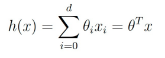

# Linear Regression

## Goal of Supervised Learning

지도 학습의 목표는 ℎ(X)이 Y의 해당 값에 대한 좋은 예측자가 되도록 함수 ℎ ∶ X → Y를 학습하는 것입니다.

- 회귀: 목표 변수가 연속형입니다.
- 분류: 목표 변수가 소수의 이산 값만을 가집니다.

## Linear Regression

inital choice로, y를 x의 선형 함수로 근사하겠습니다.

- h(x) = θ₀ + θ₁x₁ + θ₂x₂ + θ₃x₃ + θ₄x₄

θ 들은 선형 함수 공간을 매개변수화하는 매개변수(또는 가중치)로, x에서 y로 매핑됩니다.

- 선형 예측기 h(x)는 벡터 표기법을 사용하여 간단하게 설명됩니다.
    
    
    
- 매개변수 θ에 대한 Cost function는 다음과 같이 정의됩니다:

- 비용 함수를 최소화하는 최적의 θ 값을 어떻게 찾을 수 있을까요?
    - θ의 반복 업데이트 - Gradient descent algorithm (경사 하강)
    - θ에 대한 닫힌 형태의 Solution - The normal equations (정규 방정식)

### Approach 1 : Iterative Update

### Gradient descent algorithm

- 학습률 α를 사용하여 Cost function가 감소하도록 초기점 θ₀에서 θ의 값을 반복적으로 업데이트합니다.
    - Repeat until convergence (수렴시 까지 반복)
    
    
    
    - Suppose that we only have one training example (x, y).
    
    
    
- LMS update rule

### Stochastic Gradient Descent

- Stochastic (or incremental) gradient descent (SGD)
    - batch gradient descent의 대안
    - 매개변수는 단일 학습 예제에 대한 오차의 기울기에 따라 업데이트
    
    
    
    
    

### Approach 2 : Closed-form Solution

- Iterative algorithm을 사용하지 않고, cost를 최소화 할수 있는 방법
    - Step 1 : θ에 대한 J(θ)의 미분을 명시적으로 구합니다.
    - Step 2 : J(θ)의 미분을 0으로 설정합니다.
- Matrix-vectorial notation으로 cost function을 rewrite

### STEP 1 : The Normal Equations

여기서 X^TX가 가역행렬이라고 가정하고 있다.

가역행렬이 아닌 경우에는

- 선형 독립적인 예제가 특성의 수보다 작은경우
- 특성들이 서로 선형 독립적이지 않은 경우

### Probabilistic Interpretation

- J(θ)가 정말 합리적인 선택일까요?
    - 목표 변수와 입력 변수가 다음과 같은 관계에 있다고 가정합시다.
    
    
    
    - 여기서 ε^(i)는 정규분포 입니다. 따라서, 아래와 같이 나타낼 수 있습니다.
    
    
    
    
    

### likelihood function

- 모델 매개변수가 주어진 상황에서 데이터(또는 목표값)가 관찰될 "가능성"을 나타냅니다.
- 회귀 문제의 경우, 가능도 함수는 다음과 같이 정의됩니다.

- ε(i)에 대한 독립 동일 분포(i.i.d.) 가정을 사용하면, 이것은 다음과 같이 쓸 수 있습니다.

### Maximum Likelihood Estimation

- 매개변수 θ의 최적 추정값을 어떻게 선택할 수 있을까요?
- 데이터의 확률을 최대한 높게 만드는 θ를 선택합니다.
- 도출의 단순성을 위해, 대부분 로그 가능도가 최대화됩니다.
- 로그 L(θ)의 최대화는 -log L(θ)의 최소화와 같은 결과를 얻습니다.

### Basis Function

- θ ∈ ℝ^d인 경우, 기저 함수들 {φ_i ∈ ℝd → ℝ | l = 1, … , L}의 선형 조합으로 선형 회귀를 확장할 수 있습니다.

- 비선형 기저 함수를 사용하면, h(x)가 x에 대해 비선형이면서 θ에 대해서는 선형인 함수가 됩니다.

## Polynomial Regression

- 독립 변수와 종속 변수 간의 관계를 다항식으로 모델링하는 회귀 분석 방법입니다.
- 선형 회귀는 일차 함수를 사용하여 데이터를 모델링하지만, 다항식 회귀는 고차 다항식을 사용하여 복잡한 패턴의 데이터를 더 잘 설명할 수 있습니다
- 다항식 회귀는 과적합(overfitting)의 위험이 있기 때문에, 적절한 다항식 차수를 선택하는 것이 중요합니다. 교차 검증(cross-validation)과 같은 기법을 사용하여 최적의 차수를 선택할 수 있습니다.

## Underfitting and Overfitting

- 매개변수(또는 특성)의 수가 적으면 과소적합 문제가 발생할 수 있습니다.
    - 함수 근사는 데이터의 구조를 포착할 수 없습니다.
- 매개변수(또는 특성)의 수가 많으면 과대적합 문제가 발생할 수 있습니다.
    - 함수 근사는 패턴을 추출하는 것보다 데이터를 외우는 데 집중합니다.

## Overfitting 해결방법

- Non-parametric algorithm
    - Locally weighted linear regression (LWR)
    - 각 학습 예제에 음수가 아닌 가중치를 부여
- Regularized parameters
    - Ridge regression
    - 매개변수 크기를 줄이기 위해 추가적인 정규화 항을 사용합니다.

### Locally Weighted Linear Regression

- Step 1 : : Fit θ to minimize

- 특정 값 x에 대해 w(i)가 크면, θ를 선택할 때 오차 (y(i) - h_θ(x^(i)))²가 작아지도록 노력합니다.
- w(i)가 작으면, (y(i) - h_θ(x^(i)))² 오차 항은 거의 무시됩니다.
- 대역폭 매개변수 τ를 사용하여 가중치의 표준 선택은 다음과 같습니다.

- 가중치는 우리가 평가하려는 특정 점 x에 따라 달라진다는 점에 유의하세요.
• 특정 값 x에 대해 w(i)가 크면, θ를 선
- Step 2 : Output θ^Tx

### Ridge Regression

- 과대적합 문제는 일반적으로 매개변수 크기가 클 때 발생합니다.
- 정규화 항과 함께 적합 오류(또는 비용)을 최소화합니다.
    
    
    
    - 여기서 λ는 trade-off를 제어합니다.
- λ에 대해 ∂J(θ) / ∂θ = 0을 풀면 다음과 같습니다.
    
    
    

## Maximum A Posteriori

- 관찰을 통해, 좋은 매개변수 선택은 θ의 크기가 작을 수 있습니다.
    - 매개변수 θ에 대해 공분산 Σ를 가진 평균이 0인 가우시안 사전 분포를 가정합니다.
        
        
        
        
        
- θ에 대한 사후 분포는 다음과 같습니다.
    
    
    
- 가우시안 항등을 사용하여 최대화되는 지점에서 θ는 다음과 같습니다.
    
    
    
    
    
    - 다음과 같은 시그마는 릿지 회귀와 동일하게 만듭니다.