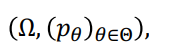

# Parametric Density Estimation

## Parametric Density Estimation

- 관측된 데이터 포인트들을 기반으로 근본적인 확률 밀도 함수(Probability Density Function, PDF)를 추정하는 기법
- 근본적인 분포가 가우시안(Gaussian), 지수(Exponential), 포아송(Poisson) 등 특정한 분포 계열을 따른다고 가정하고, 주어진 데이터를 사용하여 해당 분포의 매개변수를 추정

- Parametric density estimation을 수행하기 위한 단계는 다음과 같습니다
    - 분포 계열 선택
        - 가우시안, 지수, 포아송 등과 같은 분포 계열 중 하나를 선택.
    - 데이터를 사용하여 분포 계열의 매개변수 추정:
        - 주어진 데이터를 사용하여 선택한 분포 계열의 매개변수를 추정합니다.
        - 일반적으로 Maximum Likelihood Estimation을 사용하여 매개변수를 추정
    - 추정된 매개변수를 사용하여 확률 밀도 함수 계산
        - 추정된 매개변수를 사용하여 데이터 포인트에 대한 확률 밀도 함수를 계산
- 장점
    - 모델이 간단하고 해석하기 쉬우며, 계산상 효율적
- 단점
    - 실제 데이터가 선택한 분포 계열과 다를 경우, 정확한 확률 밀도 함수를 추정 실패 할 수 있다
    - 비모수 밀도 추정(Nonparametric Density Estimation)과 같은 다른 기법을 고려해볼 수 있다.

## Statistical Models

- ML은 주어진 작업을 수행하기 위해 데이터로부터 패턴이나 추론을 도출하는 방법
    - 패턴을 추출하는 한 가지 방법은 관측된 데이터를 생성하는 확률 모델 중 가장 가능성이 높은 모델을 찾는 것입니다. (또는 통계 모델)
- Supervised learning
    - input x 와 output y를 사용합니다.
    - mapping된 probabilistic model에 학습합니다. p( y | x, θ)
- Unsupervised learning
    - input x를 사용합니다.
    - probabilistic model을 사용하여 p(x)를 학습합니다.

## Density Estimation

- 확률 밀도 함수 p(x)를 모델링하는 문제로, 해당 밀도 함수에서 추출된 유한 개의 데이터 포인트 x1, x2, ... xn를 사용합니다.
- Density Estimation 접근방법
    - Parametric estimation
        - 밀도 모델에 대한 특정한 함수 형태를 가정하고, 데이터를 설명하는 가장 가능성이 높은 파라미터를 찾습니다. 즉, 모델 피팅을 수행합니다.
    - Nonparametric estimation
        - 특정한 함수 형태를 가지지 않고, 밀도의 형태가 데이터에 의해 완전히 결정되도록 합니다. 예를 들어, 커널 방법이 있습니다.
    - Semi-parametric estimation
        - 두 가지 방법의 장점을 모두 활용하려고 시도합니다. 예를 들어, 신경망과 혼합 모델이 있습니다.

## Parameter Estimation

- 특정한 확률 분포를 따르는 독립 동일 분포(i.i.d) 변수들의 샘플 x1, x2, ... xn을 관찰한 결과로 통계 실험이 수행됩니다.
    - 그들의 공통 분포는 p로 표시됩니다.
    
    
    
- 관련 통계 모델은
- 샘플 공간 : Ω
- 확률 측도의 가족인 (pθ) (θ∈Θ)로 이루어진 쌍입니다.
- Θ 는 파라미터 공간입니다.
- 통계 모델이 잘 지정되어 있다고 가정하면, 즉, θ*∈Θ인 존재할 때 p = p_theta* 입니다.
    - 특정 θ*는 참 파라미터라고 하며 알려지지 않았습니다.*
- *근본적인 문제는 θ_hat ≈ θ** 를 찾는 것이며, 근사의 품질은 종종 아래 식으로 측정됩니다.
    - (1) 편향 (E[θ_hat] - θ)
    - (2) 분산 Var[θ_hat - E[θ_hat]]
- 세 가지 파라미터 추정 방법이 있습니다
    - 최대 우도 추정(MLE)
    - 최대 사후 확률(MAP) 추정
    - 베이지 추론.

### Example of Parameter Estimation: Gaussian

- Noisy observation (x_i ∼ N(µ, σ^2), i = 1, … , n) 로부터 µ를 추정하려고 시도합니다.
    - Estimator 1 (first sample)
        - 첫 번째 샘플만 사용합니다.
        - µ_hat = x1, then E[µ_hat] = µ, and Var[µ_hat] = σ^2
    - Estimator 2 (average sample)
        - 평균을 사용합니다.
        - µ_bar =  (1/n) * (Σx_i), then  E[µ_bar] = µ, and Var[µ_bar] = σ^2/n
- 두 추정기 모두 편향이 없습니다, 즉, E[µ_hat] = E[µ_bar] = µ이지만, Var[µ_bar] ≤ Var[µ_hat]입니다.
- 즉, µ_bar의 위험(risk) = 0 + σ^2/n은 µ_hat의 위험(risk) = 0 + σ^2보다 작습니다.

### Example of Parameter Estimation: Coin Toss

- 동전을 던졌을 때 앞면이 나올 확률을 µ라고 합니다.
    - 동전을 10번 던져서 7번의 앞면과 3번의 뒷면을 관찰했습니다.
    - 이러한 관찰 결과를 기반으로 가장 그럴 듯한 값 µ는 무엇일까요?
- MLE (µ = 0.7)
- MAP (µ < 0.7)
    - 일반적으로 동전은 공평하다는 것을 알고 있습니다 (즉, µ = 0.5). 이것은 MLE 결과가 실험 횟수가 적기 때문일 수 있습니다.
    - 이러한 믿음(동전이 공평하다는 것)을 통계적 프레임워크에 인코딩합니다.
- Bayesian Inference
    - µ를 단일 숫자로 표현하는 것만으로는 충분하지 않습니다.
    - µ 값의 불확실성도 고려합니다.

## Maximum Likelihood Estimation (MLE)

- Likelihood Function ℒ(θ; x) : = p(D|θ) = pθ(D)는 파라미터 θ의 다양한 값에 대한 관찰 가능성을 표현합니다.
- MLE는 우도 함수를 최대화하는 파라미터 θ_MLE를 찾습니다.
    - θ_MLE ≔ argmax_θ ℒ(θ; x)

## Maximum (log-)Likelihood Estimation

- ℓ(θ; x) ≔ log ℒ(θ; x)가 종종 사용됩니다.
    - 로그는 단조 증가하기 때문에 다음이 성립합니다.
    - θ_MLE ≔ argmax_θ ℒ(θ; x) = argmax_θ ℓ(θ; x)
- 각각의 Point D = {x1, … , xn}에서 기본 분포 p(x|θ)에서 독립적으로 추출된 것으로 가정합시다.
    - 그럼 우리는 다음과 같음을 알 수 있습니다. p(D|θ) = ∏ log( p( xi | θ ) )
    - ℓ(θ; D) = Σ log( p( xi | θ ) )

## Interpretation of MLE

- 데이터셋 x = {x_1, ..., x_n}의 각 샘플이 기본 분포 p(x|θ)에서 독립적으로 추출된 것으로 가정합시다.
    - 경험적 분포는 p_emp(x) = (1/n)Σδ(x - x_i)로 주어집니다. 여기서 δ(·)는 디랙-델타 함수입니다.
    - 모델 피팅은 경험적 분포 p_emp(x)와 모델 p_mod(x) = p(x|θ) 사이의 거리를 최소화함으로써 수행할 수 있습니다.
    - 인기 있는 거리 쿨백-라이블러(KL) 발산이 사용됩니다.
        
        
        
    - KL 발산의 경우, MLE와 KL 매칭 간의 상응 관계가 있습니다.
        
        
        

### Example of MLE: Gaussian

- empirical mean is equal to the solution of MLE
    - x̅ = θ_MLE
- µ = (µ_1, µ_2) = (µ, σ^2)인 log-likelihood는 아래와 같습니다.
    
    
    
- ∇_θℓ(θ) = 0인 지점을 찾으면
    
    
    
    
    
- 결국 MLE는 표본평균과, 표본 분산과 같습니다.

## Maximum A Posteriori

- 최대 사후 확률
- MLE처럼 MAP도 데이터 D를 생성하는 매개변수 θ에 의한 확률 모델 p(D|θ)를 가집니다.
- 추가로, 매개변수 θ의 사전 분포 p(θ|α)를 가정합니다.
    - 초매개변수 α는 사전 분포를 정의합니다.
    - 라틴어에서 "a priori"는 "앞서서"를 의미하고 "a posteriori"는 "나중에"를 의미합니다.
- MAP는 사후 분포 p(θ|D)를 최대화하는 매개변수 θ_MAP를 찾습니다.
    
    
    
- 사전 확률 p(θ)은 과적합을 방지하는 데 중요한 역할을 합니다.
- 만약 우리의 믿음이 함수가 부드러워야 한다면, 사전 확률은 복잡한 모델에 패널티를 부여하는 정규화항처럼 작용하고, 간단한 모델을 선호합니다.

### Example of MAP: Gaussian

- θ가 알려지지 않은 평균 µ를 가진 독립 동일 분포(i.i.d)의 일변량 가우시안 랜덤 변수 X_i로 구성된 n개의 사본이라고 가정하겠습니다. 사전 분포 p(µ|α) ∼ N(0, α)를 가정합니다.
    - MAP 솔루션은 다음 손실 함수를 최대화합니다.
    
    
    
    
    
    - α ≫ n/σ^2 인 경우, 즉 사전 분포가 데이터보다 약할 때, 결과를 얻습니다.
    - α ≪ n/σ^2 인 경우, 즉 사전 분포가 데이터보다 강할 때, 결과를 얻습니다.
        - 데이터 포인트가 매우 적은 경우, 사전 분포는 추정치를 사전 예상 값에 편향시킨다.

## Bayesian Inference

- 베이지안 추론
- MLE/MAP는 데이터 D를 나타내는 매개변수 값 θ를 추출합니다 (θ_MLE 또는 θ_MAP).

- 베이지안 추론은 특정 매개변수 값 대신 모든 θ 값에 대한 가중 평균을 통해 이들을 직접 추정하려고 시도합니다.

- 베이지안 추론은 매개변수에 대한 확률 분포를 유지하므로, 불확실성을 포함한 추론을 제공합니다. 이는 MLE 및 MAP와 같은 점 추정이 아닌, 전체 매개변수 공간에 대한 평균을 계산함으로써 이루어집니다. 이로 인해 베이지안 추론은 더 강인하고, 불확실성이 높은 상황에서 더 나은 예측을 제공할 수 있습니다.
- posterior distribution는 베이즈 정리(Bayes rule)를 사용하여 업데이트됩니다.
    - likelihood는 p(D|θ) = ∏(i=1 to N) p(x_i|θ)로 주어집니다.
    
    
    
- Conjugate prior는 주어진 p(x|θ)에 대해 동일한 함수 형태를 갖는 사후 분포 p(θ|D)를 생성하는 사전 분포 p(θ)입니다.
- 분석의 용이성을 위해 Conjugate prior를 사전 분포로 사용하는 것이 좋은 선택입니다.
- Conjugate prior를 사용하면 사후 분포를 계산하는 과정이 단순화되고, 사후 분포의 함수 형태를 쉽게 파악할 수 있습니다. 이를 통해 베이지안 추론의 복잡성이 줄어들며, 매개변수 추정에 필요한 계산이 더 간단해집니다.

### Conjugate Priors

| Prior | Likelihood | Posterior |
| --- | --- | --- |
| Beta | Bernoulli | Beta |
| Beta | Binomial | Beta |
| Normal | Normal | Normal |
| Gamma | Gammma | Gamma |
| Gamma | Poisson | Gamma |
| Normal-Gamma | Normal | Normal-Gamma |

## Beta-Bernoulli Conjugacy

- 관측된 x를 bernoulli 분포로 모델링 할 수 있으며, 아래와 같이 나타낸다.

- µ가 알려지지 않았기 때문에, α와 β로 파라미터화된 베타 분포로 대체할 수 있습니다.

- 주어진 데이터 D에 대한 µ의 사후 분포는 다음과 같이 설명됩니다.

### Bayesian Inference: Normal-Normal-Normal

- N개의 실수 데이터 포인트 집합 D = {x_1, ..., x_N}가 주어졌을 때, 다음을 가정합니다.

- 이러한 가정에서 베타-베르누이 켤레성은 베르누이 가능도와 베타 사전 분포를 사용하여 θ의 사후 분포를 쉽게 계산할 수 있게 합니다. 데이터 포인트 수 N이 증가함에 따라 사후 분포는 실제 평균에 점점 가까워지며, 분산은 줄어들게 됩니다. 이를 통해 데이터를 바탕으로 θ에 대한 불확실성을 효과적으로 업데이트할 수 있습니다.