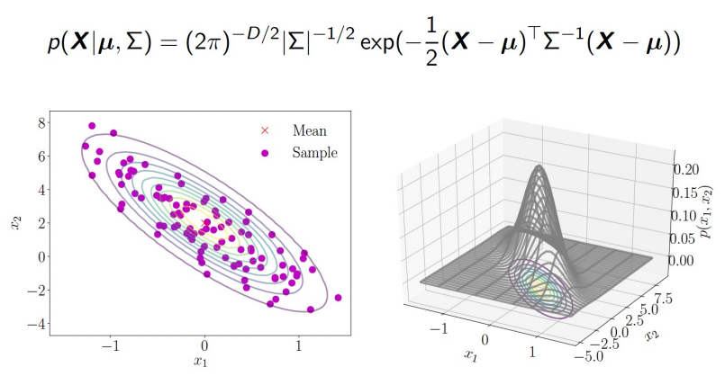

# Recap of Math

## Probability Space

- 확률 공간
- 확률 공간은 삼중 (Ω, ℱ, P)으로 정의됩니다
    - 표본공간 Ω
    - **σ - Field**  ℱ
    - 확률 P : ℱ → [0,1]
- Sample space (표본공간) Ω
    - Ω은 가능한 모든 결과의 집합
    - 결과 (incidence or sample)은 모델의 단일 결과입니다.
        - EX) 두 번의 연속적인 동전 던지기 : Ω = {hh, tt, ht, th}
- Event E is subset of Ω
    - EX) {hh}, {ht, th}, ...

## Field and **σ**-Field

- ℱ은 Ω의 부분집합 (또는 사건)의 모음이면서 다음 조건을 만족하면 Field를 형성합니다.
    - ∅ ∈ ℱ이고, Ω ∈ ℱ
    - ∀E1, E2 ∈ ℱ, E1 ∪ E2 ∈ ℱ 이고, E1 ∩ E2 ∈ ℱ
    - ∀E ∈ ℱ, E의 여집합 ≔ Ω \ E ∈ ℱ
    - 예를 들어, Ω = {hh, tt}인 경우 {{hh}, {tt}, {hh, tt}}는 Field입니다.
- Field ℱ이 모든 집합에 대해 닫혀 있으면 σ - field입니다.
    - 이는 무한 가산 집합의 확장이 필요한 연속 확률 변수를 다루기 위해 중요합니다.
- 무한 가산 집합의 확장은 연속 확률 변수를 처리하기 위해 필요합니다.

## Probability Measure

- 확률을 공식적으로 정의하려면 σ - field 가 필요하며, 도메인을 정의합니다.
- 샘플 공간 Ω와 σ - field ℱ⊂2^Ω가 주어지면 함수 P: F ↦ [0, 1]은 확률입니다.
- 확률 함수는 다음과 같은 조건을 만족해야 합니다.
    - A ∈ ℱ인 모든 이벤트 A에 대해 P(A) ≥ 0, P(∅) = 0 및 P(Ω) = 1
    - 모든 이벤트 {Ai}i∈I에 대해, Ai ∩ Aj = ∅ (i ≠ j ∈ I),
        - P∪i∈IAi = Σi∈I&P(Ai)

## Properties of Probability

### Joint probability

- P(A, B) = P(A∩B)
- 두 개 이상의 이벤트가 동시에 발생할 확률을 의미합니다.

### Marginal probability

- P(A), P(B)
- 두 가지 이상의 이벤트에 대한 조인트 분포에서 각각의 이벤트에 대한 확률 분포를 계산하는 방법입니다. 예를 들어, A와 B 두 이벤트가 있을 때 P(A)와 P(B)를 계산하여 얻을 수 있습니다.

### Independence between A and B

- P(A, B) = P(A)P(B)

### Conditional probability

- 조건부 확률은 다른 사건이 발생한 경우에 발생할 사건의 확률입니다.
- P(A|B)로 표시되며, P(A|B) = P(A ∩ B) / P(B)로 정의됩니다. 이 때, P(B) ≠ 0입니다.

### Law of total probability (a.k.a. marginalization)

- 전체 확률의 법칙(혹은 총 확률의 법칙)은 확률 이론에서 가장 기본적인 개념 중 하나입니다. 이 법칙은 어떤 사건의 확률을 계산할 때, 그 사건이 일어날 수 있는 모든 가능한 방법을 고려하며, 다른 하나 이상의 확률 변수의 모든 가능한 값에 대해 고려하는 것을 의미합니다.
- A, B가 확률 공간에서 두 개의 사건이고, {B1, B2, ..., Bn}이 샘플 공간의 분할(partition)일 때
- P(A) = ∑P(A,Bi) = ∑P(A|Bi)P(Bi)
- 마진화(marginalization)는 원하지 않는 데이터를 제거하는 기본적인 데이터 처리 작업 중 하나입니다. 이는 베이즈 통계학에서 매우 중요한 역할을 합니다.

## Bayes theorem

- P(A | B) = (P(B | A) * P(A)) / P(B)
    - P(A | B): B가 주어졌을 때 A가 발생할 확률 (사후 확률, posterior probability)
    - P(B | A): A가 주어졌을 때 B가 발생할 확률 (우도, likelihood)
    - P(A): A가 발생할 확률 (사전 확률, prior probability)
    - P(B): B가 발생할 확률 (주변 확률, marginal probability)
- 머신러닝에서 베이즈 정리의 유용성:
    - 관측치 x가 주어졌을 때, 잠재 변수 y를 최대화하는 값을 찾고자 함
    - 하지만 확률 모델은 주로 P(y | x)가 아닌 P(x | y)P(y)를 설명함

## Random Variable

- 실험에서의 무작위 결과 ω와 실수 집합 ℝ 사이의 대응 규칙
    - 간소화를 위해, X(ω) 대신 X를 사용함
    - X의 확률 분포는 P(X)로 표시됨
    - 랜덤 변수의 범위를 지지 집합(support)이라고 함
    

## Continuous Probability

- 연속 변수에서 확률은 무한한 개의 점들에 대해 정의되기 때문에, 단일 점의 확률은 항상 0
    - 확률은 구간에 대해 측정되며, 단일 Point가 아님
- 확률 밀도 함수(Probability Density Function, pdf)
    - 함수 f는 다음 조건을 만족할 때 확률 밀도 함수라고 함
        - 모든 x ∈ ℝ에 대해 f(x) ≥ 0
        - 적분이 존재하며, ∫ℝ f(x)dx = 1
    - 따라서, 주어진 구간 [a, b]에서의 확률은 ∫[a, b] f(x)dx로 계산됨
    - 확률 곡선 아래의 면적은 1과 같아야 합니다.
    - 특정 지점에서의 f(x) 값은 1보다 큰 값을 가질 수 있습니다.
- 누적 분포 함수(Cumulative Distribution Function, CDF):
    - 다변수 실수 값(랜덤) 변수 X에 대한 누적 분포 함수는 상태 x ∈ ℝ에서 정의되며, 다음과 같이 표현됩니다.
        - F(x) = P(X1 ≤ x1, ..., Xn ≤ xn)
    - CDF는 확률 밀도 함수 f(x)의 적분으로도 표현할 수 있습니다.
        - F(x) = ∫...∫[f(t1, ..., tn) dt1...dtn] (제한: t1 ≤ x1, ..., tn ≤ xn)

## Expectation and Moments

- Expectation(기댓값) :  E[X] ≔ ∑x P(X = x)
- X의 k차 moment : E[X^n] ≔ ∑x^n P(X = x)
- 평균(Mean, 첫 번째 모멘트, 평균, 기대값)
    - μ ≔ E[X] = ∑x P(X = x)
- 분산(Variance, 두 번째 중심 모멘트)
    - σ^2 ≔ E[(X - μ)^2] = E[X^2] - μ^2
- 공분산(Covariance, 상관 관계 측정)
    - Cov(X, Y) ≔ E[ (X - E[X])(Y - E[Y]) ]
    - **X와 Y가 독립적일 경우, Cov(X, Y) = 0**

- 정리
    
    Consider random variables X, Y and constant c
    
    - E[c] = c
    - E[cX] = cE[X]
    - E[X + Y] = E[X] + E[Y]
    - E[XY] = E[X]E[Y]  // (X와 Y가 독립적인 경우)
    

## Sample Mean

- 머신러닝에서 무작위 변수의 합을 연구하는 것은 특히 흥미롭다.
- 평균의 추정치로 표본 평균을 자주 사용한다.
    - 표본 평균: (1/n) ΣX_i (i: 1~n)
- 대수의 법칙은 표본 평균이 (i) 표본 수가 증가하고 (ii) 모든 표본이 서로 독립적일 때 (분산이 제한되어 있는 경우) 참 기댓값에 수렴한다는 것을 보장한다.
    - (1/n) ΣX_i ⟶ E[X] as n ⟶ ∞
    - E[X] ≈ (1/n) ΣX_i
    

## Bernoulli Distribution

- 이산확률분포로, 성공/실패 두가지 결과만을 가지는 단일 시행의 결과를 모델링한다.
- 베르누이 확률변수 X ∼ Ber(p)는 집합 {0, 1}을 가지며,
    - P(X = x) = p^x(1-p)^(1-x)
    - P(X = 1) = p
    - P(X = 0) = 1 - p
- 평균 : E[X] = p
- 분산 : Var(X) = p(1 - p)

## Binomial Distribution

- 동일한 확률을 가지는 독립적인 베르누이 시행을 n번 반복했을 때 성공하는 횟수에 대한 확률을 모델링
- 이항 분포 Bin(n, p)는 매개변수 p ∈ [0, 1]와 n ∈ ℕ를 가집니다.
- 이항 확률변수 X ∼ Bin(n, p)는 집합 {0, 1, ..., n}을 가지며, 확률은 다음과 같습니다.
    - P(X = k) = C(n, k) p^k (1 - p)^(n-k), 여기서 C(n, k) = n! / (k!(n-k)!)
- 이항 확률변수는 n개의 독립적인 베르누이 확률변수의 합으로 해석할 수 있습니다.
- 평균 E[X] = np와 분산 Var(X) = np(1 - p)를 가집니다.
- 이 계산은 대수의 법칙의 예로 볼 수 있다.
    - E[X/n] = p, Var(X/n) = p(1-p)/n → 0 (n → ∞)

## Beta Distribution

- 0과 1 사이의 값을 가지는 연속 확률 분포입니다.
- 두 개의 양수 매개변수 α와 β를 가지며, 이 매개변수에 따라 분포의 모양이 달라집니다.
- 확률변수가 [0, 1] 구간에 제한되어 있는 경우에 사용되며, 특히 베르누이 분포의 매개변수 p를 모델링하는 데 사용
    - 베타 분포 Beta(α, β)는 매개변수 α, β > 0을 가집니다.
    - 베타 분포 확률변수 X ∼ Beta(α, β)는 지지 집합 [0, 1]을 가지며,
        - P(X = x) ∝ x^(α-1) (1 - x)^(β-1)
    - 베타 분포는 베르누이 분포의 매개변수 p를 모델링하는 데 종종 사용됩니다.
        - 평균 : E[X] = α / (α + β)
        - 분산 : Var(X) = (αβ) / ((α + β)^2 (α + β + 1))

## Gaussian (or Normal) Distribution

- 정규 분포(Normal Distribution)는 연속 확률 분포로, 자연과 사회 현상에서 많이 나타나는 현상을 설명하는 데 사용됩니다.
- 종 모양의 대칭적인 분포로, 중심극한정리에 의해 여러 독립적인 확률변수들의 합은 정규 분포에 가까워지는 성질을 가지고 있습니다.
- (Univariate) 가우시안 분포 N(μ, σ^2)는 매개변수 μ ∈ ℝ와 σ^2 > 0을 가집니다.
- 단변량 가우시안 확률변수 X ∼ N(μ, σ^2)는 지지 집합 ℝ을 가지며, 확률밀도함수는 다음과 같습니다.
    - P(X = x) = (1 / (σ * sqrt(2π))) * exp(-(x - μ)^2 / (2σ^2))
- 가우시안 분포의 평균은 E[X] = μ이고 분산은 Var(X) = σ^2입니다.
- 평균과 (공)분산에 의해 직접 매개변수화되며, 중심극한정리가 적용
- 평균과 공분산 행렬이 주어진 경우 최대 엔트로피를 가지는 분포입니다.

## Central Limit Theorem

- 중심극한정리는 독립적이고 동일한 분포를 따르는 확률변수들의 합이나 평균이 표본의 크기가 커짐에 따라 가우시안 분포에 접근한다는 것을 말합니다.

### Lindeberg-Levy central limit theorem (CLT)

Lindeberg-Levy 중심극한정리(CLT)는 중심극한정리의 일반적인 형태로, 독립적이고 동일한 분포를 따르는 확률변수들의 샘플 평균이 표본의 크기가 커짐에 따라 정규분포에 수렴한다는 내용입니다.

Lindeberg-Levy CLT에 따르면:

1. X1, ..., Xn을 평균이 μ이고 분산이 σ^2인 독립 동일분포(i.i.d) 확률변수들의 무작위 수열이라고 가정합니다.
2. 샘플 평균을 다음과 같이 정의합니다: Sn = (1/n) * ∑(Xi) (i=1 부터 n까지)
3. 표본의 크기 n이 무한대로 갈 때, (Sn - μ)의 분포가 정규분포 N(0, σ^2/n)에 수렴합니다.

간단히 말해, 독립적이고 동일한 분포를 따르는 확률변수들의 샘플 평균은 표본 크기가 증가함에 따라 평균이 μ이고 분산이 σ^2/n인 정규분포에 접근합니다. 이러한 결과는 통계적 추론에서 가우시안 분포를 기본 가정으로 사용하는 데 있어 중요한 역할을 합니다.

## Multivariate Gaussian PDF

- 다차원 확률변수들이 따르는 정규분포입니다.
- 평균 벡터와 공분산 행렬에 의해 결정됩니다.

- n은 확률변수의 개수입니다.
- |Σ|는 공분산 행렬 Σ의 행렬식입니다.
- exp(x)는 지수 함수 e^x입니다.
- (X - μ)^T는 (X - μ) 벡터의 전치입니다.
- Σ^(-1)는 공분산 행렬 Σ의 역행렬입니다.

## Random Vector and Covariance

### Random Vector

- 여러 확률변수들을 하나의 벡터로 구성한 것입니다. 예를 들어, n개의 확률변수 X1, X2, ..., Xn을 갖는 무작위 벡터 X는 다음과 같이 표현됩니다:
    - X = [X1, X2, ..., Xn]^T

무작위 벡터는 다차원 데이터를 다루는 데 사용되며, 주로 다변수 확률분포와 관련하여 연구됩니다.

### Covariance

- 두 확률변수 사이의 선형 상관성을 측정하는 값입니다. 두 확률변수 Xi와 Xj의 공분산은 다음과 같이 정의됩니다:
    - Cov(Xi, Xj) = E[(Xi - E[Xi])(Xj - E[Xj])]