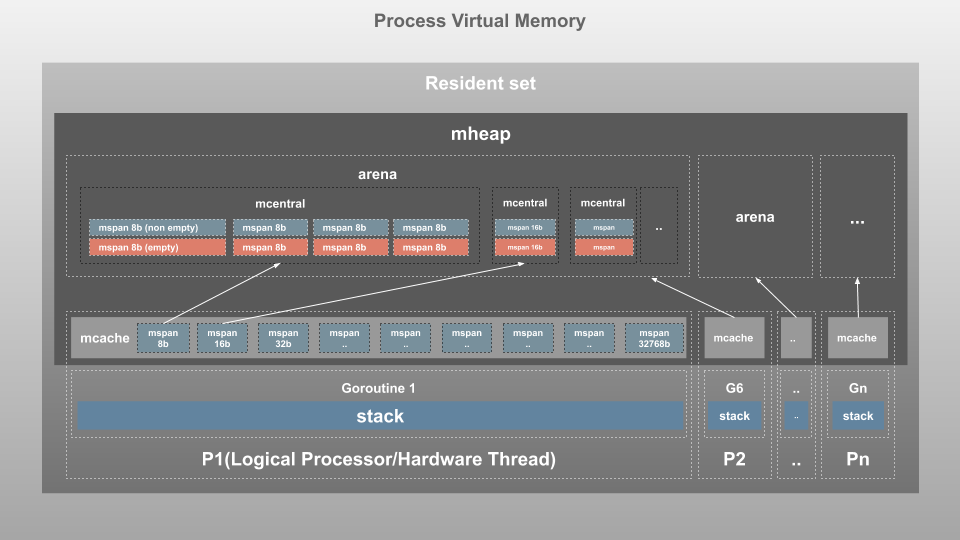

# Memory Management

이 글은 [블로그 글](https://deepu.tech/memory-management-in-golang/) 및 [mGC Code](https://github.com/golang/go/blob/master/src/runtime/mgc.go), [mHeap Code](https://github.com/golang/go/blob/master/src/runtime/mheap.go)를 기반으로 공부한 글 입니다.

# Memory Management

## Software

- software는 os에서 동작할때, RAM에 접근
    - Program LOAD
    - Data value, structure STORE
    - Program Run-time LOAD

## Stack  & Heap

- Stack
    - static memory allocation
    - LIFO
    - Stack의 Top data를 Read/Write하기 떄문에, 빠름
    - complie time에 size가 정해짐
    - 유한한 Size
    - thread마다 stack memory를 가질 수 있음
    - local 변수, 포인터, function frame
    - stack overflow 조심
- Heap
    - dynamic memory allocation
    - pointer를 통해 접근
    - thread들이 공유
    - 전역변수, 레퍼런스 타입
    - Application에 할당된 Heap영역을 넘어서면 OOM

## Garbage Collection

- Application에서 메모리가 과도하게 사용되어, 메모리 리소스가 부족하면 문제발생
- Application에서 메모리 관리가 필요
- C/C++ 같은 언어들은 개발자가 직접 메모리할당/해제를 관리
- 메모리 관리에 어려움으로 자동으로 관리하는 방법을 제공하려 함.
    - 자동으로, 사용하지 않는 메모리를 수집해서 정리하는게 GC

```yaml
GC는 일반적으로 아래의 과정을 거칩니다

- GC 수행 시간 동안 GC를 수행하는 쓰레드를 제외한 모든 쓰레드가 일시정지 (STW)
- GC는 참조할 수 없는 객체에 대한 메모리를 해제
- GC가 끝난 뒤 일시정지되었던 쓰레드의 작업들이 재개
```

- GC의 두가지 방식
    - Mark & Sweep GC
        - Stack에서 존재하는 Object나 변수에서부터 Heap의 참조를 확인하면서 GC를 시작
            - Heap의 참조를 확인하면서 GC를 시작하므로 이들을 GC Root라고 부름
        - 두가지 단계로 분리
            - Mark
                - GC Root에 해당하는 Object나 변수가 참조하는 메모리들을 따라가 `alive` 표시
            - Sweep
                - `alive` 가 아닌 Object들의 메모리 할당을 해제
        - 지울 메모리를 Mark하고 Sweep하는 방식
        - 기본적인 개념이며, 변형 GC들이 존재
        - JVM, C#, Go 등에서 사용
    - Reference Couting GC
        - 모든 Object의 참조되는 횟수인 Reference count를 가짐.
        - Count가 0이 된 Object는 GC가 수행되며 지워짐
        - PHP, Python 등에서 사용

# Go의 Memory Management

- Garbage Collection, Scheduling & Concurrency를 수행하는 런타임 내장
- STD Library를 통해수행됨
- TCMalloc과 유사한 구조를 사용해 메모리 단편화를 최소화 하고, lock을 줄이고 있다.
- [TCMalloc에 대해서](https://goog-perftools.sourceforge.net/doc/tcmalloc.html)
- TCMalloc
    - Google에서 만든 TCMalloc 방식의 메모리 관리
    - Memory Pool
        - 보통 멀티쓰레드 환경의 서버는 Memory Pool을 사용함.
        - 메모리가 필요할 때마다, malloc을 호출해서 메모리를 할당하지 않고, 큰 Memory pool에서 필요한 만큼 잘라서 쓰는 방법
        - 여러 쓰레드에서 하나의 메모리 풀에 접근하게 되면, lock/wait 가 발생하고, 이에 따른 cost/delay가 발생하게됨
    - TCMalloc에서는 Thread마다 메모리풀을 따로 두고, 여러 쓰레드에서 접근해야 하는 메모리는 전역 메모리풀을 따로 두고 관리한다.
        - 즉, Thread Local Cache(Thread memory), Central Heap(page heap)으로 나누어서 관리
    - Thread memory는 32KB 이하의 작은 object를 담당하고, 메모리가 부족해지면 Central Heap에서 메모리를 얻어와 할당한다.
    - Central Heap에서는 32KB가 넘어가는 큰 object들을 담당해 할당하며 4KB의 페이지 단위로 나누어 할당하며 사실상 일반적인 메모리 풀과 같다.
    - Thread memory를 사용하므로서, lock으로 인한 Cost/Delay가 크게 줄어들어 성능이 크게 향상된다.
    - 만약 Page Heap도 충분하지 않은 경우 OS에 메모리를 더 요청한다.
    - 작은 object의 할당 속도를 높이기 위해 thread-local cache를 사용하며
    - GC의 속도를 높이기 위해 scan/noscan을 유지합니다
        - `scan`으로 표시된 객체는 힙(heap) 내의 다른 객체를 참조하는 포인터를 포함하고 있습니다.
        - `noscan` 으로 표시된 객체는 힙(heap) 내의 다른 객체를 가리키는 포인터가 없습니다. 따라서 가비지 컬렉터는 이러한 객체를 참조로 검사할 필요가 없습니다. 이는 참조해야 할 객체 수를 줄여 가비지 컬렉션 프로세스의 효율성을 향상시킬 수 있습니다.
    - 이러한 TCMalloc 구조는 **단편화를 방지하여 GC 동안에 compaction을 불필요하게 만듭니다**
    

## Go Virtual memory

### Go Virtual memory struct



### Memory allocator

- Allocator는 page를 사용할 때 사용됩니다.
- small allocation size(32KB 이하)는 약 70개의 Size Class 중 하나로 반올림되어 할당되며, free bitmap으로 managed됩니다.

```yaml
fixalloc: a free-list allocator for fixed-size off-heap objects,
		used to manage storage used by the allocator.
mheap: the malloc heap, managed at page (8192-byte) granularity.
mspan: a run of in-use pages managed by the mheap.
mcentral: collects all spans of a given size class.
mcache: a per-P cache of mspans with free space.
mstats: allocation statistics.
```

- Page Heap(mheap)
    - Heap 영역
    - GC가 수행되는 영역
    - 32KB보다 큰 object를 직접할당 (central lock) 사용
    - central lock을 사용하기 때문에, 한번에 하나의 P 할당요청만 처리 가능하다.
- Resident set
    - 8B 크기의 mspan으로 나뉘며 모두 하나의 mheap object의해 모두 관리
- mspan
    - mheap에서 page를 관리하는 기본구조
    - Double-linked list
        - start page의 address, size class, page num을 가짐
    - 8B ←→ 32KB이하 사이즈 별로 67개 클래스의 블럭으로 나뉨
    - 각 span은 짝수개로 존재하며, 각각 scan class, noscan class를 저장한다. 이런 구조는 gc동안에 noscan span에 도달하면, 더이상 scan할 필요가 없는 장점이 존재한다.
- mcentral
    - 같은 크기의 span class 별로 span들이 그룹화 된 구조
    - mcentral 마다 두개의 mspanList를 포함
        - empty list
            - allocated object나 mcache에 cache된 span list
            - double-linked list
        - non-empty list
            - free object의 span들의 list
            - 새로운 span이 요청되었을때 non-emptylist는 empty list로 이동함.
    - mcentral의 non-empty list에 더이상 mcache를 위해 할당할 수 있는 span이 없는 경우,mcentral은 아래처럼 mheap으로부터 새로운 span들을 요청하여 mcache에 전달
- arena
    - 많은 메모리가 필요해지면, mheap은 arena라고 불리는 64MB덩어리를 Virtual Memory로 부터 당겨온다.
    - page들은 이 영역에서 span들에게 묶인다.
- mcache
    - P가 작은 개체들 (≤32KB)를 저장하기 위한 Cache Memory
    - Goroutine들은 아무런 lock없이 mcache로 부터 메모리를 얻을 수 있는 구조
        - 모든 P영역은 분리되어 있고, P는 한번에 하나의 Goroutine들만 다루므로 lock이 필요없음.
    - 모든 class 크리별 mspan의 scan/noscan type을 포함
    - 새로운 span이 필요해지면 mcentral에 요청하여 non-empty list를 얻을 수있음.
- stack
    - golang은 main stack영역과 goroutine마다 하나의 stack이 존

### Allocating a smail object (use a hierarchy of caches)

```yaml
$1. size를 smail size class 중 하나로 올림한다.
2. 해당 P의 mcache의 mspan을 찾는다.
3. Free slot을 찾기 위해, 해당 m free bitmap을 scan한다.
	- free slot이 있으면 해당 slot에 할당한다.
4. Free slot이 없으면 필요한 크기의 size class에 대한 mcentral의 free space가 있는 mspan list에서 새로운 mspan을 얻습니다.
5. 만약 mcentral의 mspan list가 empty라면, mheap에서 가져옵니다.
6. 만약 mheap이 비어있거나 충분히 큰 page가 없다면, os에서 새로운 page group (적어도 1MB)를 할당합니다.
```

### Sweeping an mspan and freeing objects

```jsx
1. allocation에 대한 응답으로 mspan이 sweep되면, 해당 mspan은 mcache로 돌아갑니다.
2. mspan에 여전히 할당된 객체가 있다면, mspan의 size class에 대한 mcentral free list에 위치시킵니다.
3. mspan의 모든 객체가 무료인 경우, mspan의 page가 mheap으로 반환되고 mspan은 사용되지 않습니다.
```

# Go Garbage Collection

- Non-Generational concurrent tri-color mark and sweep
- Go는 P마다 할당을 수행 하기 때문에 Lock을 최소화하였고, mutator thread들에 의해 concurrent하게 GC를 수행 가능합니다.
- Go Memory allocation에서 Size class별로 진행하여서 단편화를 최소화 시켜놓았기 때문에 non-generational
- tri-color mark and sweep : 3가지 색(white, gray, black)을 사용한 알고리즘
    - Mark Setup(STW : Stop the world)
        - GC가 시작되면 STW라는 프로세스로 Application의 동작을 중지하는 동안 모든 P와 Goroutine이 GC safe point로 도달
        - 데이터 무결성을 보장하기위해 Write Barrier를 On하여 Heap의 데이터 무결성을 유지
    - Marking(Concurrent)
        - Write Barrier를 가지게되면, Go runtime은 동작을 다시 시작하고 worker들은 Marking을 수행
        - 모든 Object를 White로 Stack의 GC Root object를 gray로 표시
        - GC Root에서부터 marking을 시작하고 marking되는중에 traverse되는 object를 회색으로 표시
        - marking이 수행되면 해당 mark가 수행되는 P와 Goroutine은 block됨.
        - marking이 완료되면 P와 Goroutine은 다시동작
        - 새롭게 할당되는 object는 Black으로 표시
    - Mark Termination (STW)
        - 모든 Goroutine들이 marking이 완료되면, 중지되고 write barrier를 off
        - goroutine은 다시 활성화
        - gray로 표시된 object들은 black이 되기위해 queueing 되어 있으며, 여전히 사용중인 object란 의미를 가진다.
        - 모든 gray가 black으로 바뀌게 되면 marking이 완료된것
        - 이 작업동안 다음 GC일정을 계산
    - Sweeping(Concurrent)
        - Collection이 끝나고 할당이 시도되면 sweep작업이 수행되며 white object를 정리한다.
        - 즉, `alive` 표시되지 않은 Heap영역의 데이터를 청소한다.
        - 이 작업은 App이 동작하면서 Background에서 concurrent하게 수행됨.


- `Heap영역을 많이 사용할 수록 STW 기간이 길어진다.`
